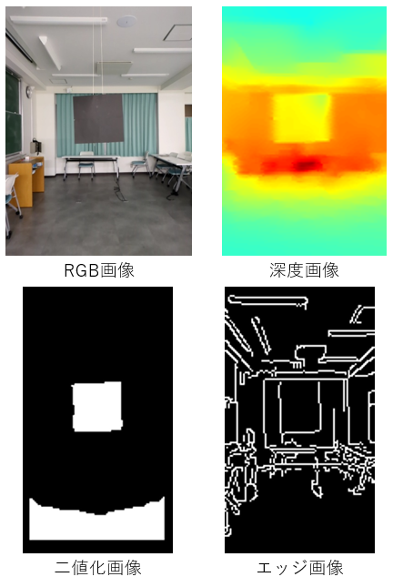
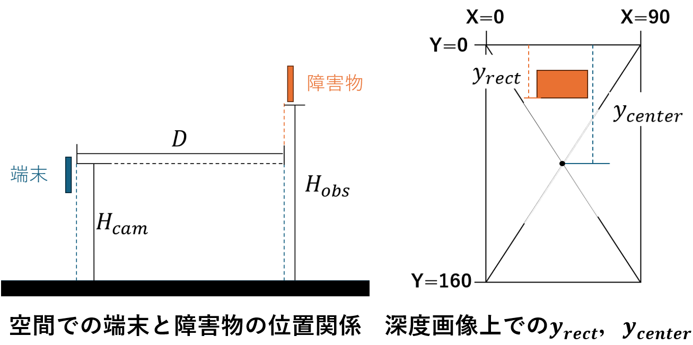
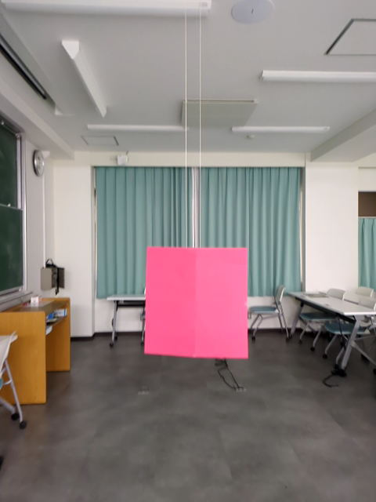
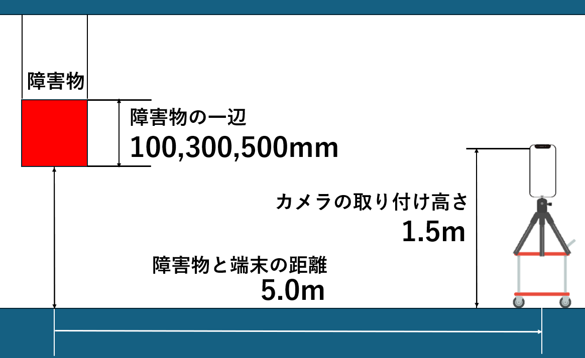
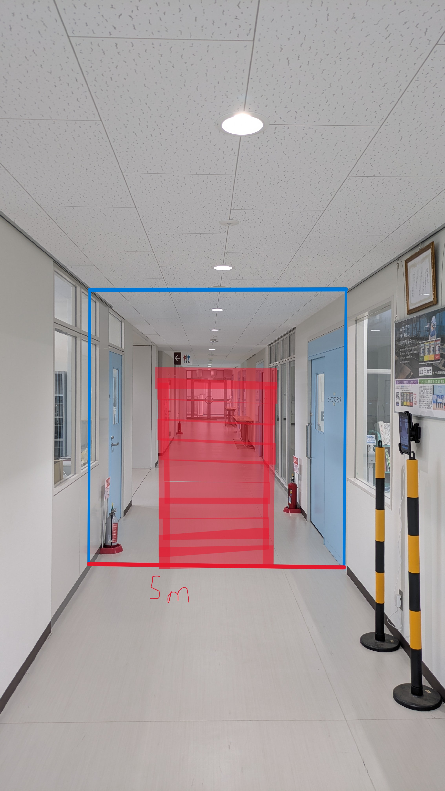
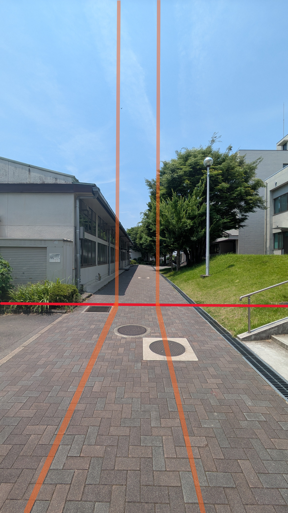

# ARCore Depth Hazard Detection

[](https://github.com/Jr34374/arcore-depth-hazard-detection/actions/workflows/android.yml)

ARCore Depth API と OpenCV を用いて、進行方向にある高所障害物の距離と下端高さを推定するAndroidアプリです。白杖では捉えにくい看板や木の枝などへの衝突を、対応するAndroidスマートフォンで事前に検知することを目指して卒業研究で開発しました。

> An Android research prototype that estimates the distance and bottom height of overhead obstacles using ARCore Depth and OpenCV.

[4ページで読めるポートフォリオPDF](docs/portfolio/arcore-depth-hazard-detection-portfolio.pdf)

## プロジェクト概要

| 項目 | 内容 |
| --- | --- |
| 開発形態 | 個人開発・卒業研究 |
| 開発期間 | 2025年度 |
| 担当 | 課題設定、手法設計、Android実装、評価実験、データ分析、論文執筆 |
| 実験端末 | Google Pixel 7a |
| 評価規模 | 27条件、計135試行 |
| 主な結果 | 検知できた試行における高さ近似率 平均88.97% |
| 現在の位置づけ | 研究用プロトタイプ。実用化には検知安定性と通知方法の改善が必要 |

卒業研究完成時点のコードは [`v0.1.0-graduation-snapshot`](https://github.com/Jr34374/arcore-depth-hazard-detection/tree/v0.1.0-graduation-snapshot) として保存しています。`main` では研究成果を保ちながら、再現性・可読性・テスト・アクセシビリティを改善していきます。

## 背景と課題

視覚障害者の歩行支援に広く利用される白杖は、足元の段差や障害物の確認には有効です。一方、胸部や頭部付近にある吊り下げ看板、街路樹の枝などは白杖の探索範囲に入りにくく、接触前に把握することが困難です。

高精度な距離計測にはLiDARが利用できますが、対応端末が限られます。本研究では専用センサーを必須とせず、単眼カメラ画像と端末の動きから深度を推定できるARCore Depth APIを採用しました。より多くのAndroid端末で利用できる歩行支援技術への第一段階として、障害物下端の高さ推定に取り組みました。

## 提案手法



1. ARCoreから16 bit深度画像とカメラ内部パラメータを取得する
2. 画面上部20%の深度中央値を、そのフレームの背景深度として求める
3. 背景より手前の領域を二値化する。公開スナップショットの設定では、左右端5%、上端20%、下端5%を検出対象外にする
4. 収縮処理で床・壁とつながった領域を切り離し、OpenCVで輪郭を抽出する
5. RGB画像のCannyエッジを用いて、低解像度な深度画像上の障害物下端を補正する
6. 障害物領域の深度中央値とピンホールカメラモデルから、距離と下端高さを推定する
7. 推定結果と検証用画像を表示・保存し、実験データをJSONに記録する

処理負荷を抑えるため、卒業研究版では10フレームごとにCPU画像処理を実行します。



高さ推定では、カメラの設置高さ、障害物までの距離、画像中心から障害物下端までのピクセル差、焦点距離を利用しています。

## 卒業論文の評価実験

| 条件 | 設定 |
| --- | --- |
| 色 | 黒・赤・白の3種類 |
| 一辺の長さ | 500 mm・300 mm・100 mm |
| 障害物下端の高さ | 1.0 m・1.4 m・1.8 m |
| 試行数 | 27条件 × 各5回 = 135試行 |
| 開始距離 | 5.0 m |
| カメラ設置高さ | 1.5 m |

| 評価指標 | 結果 |
| --- | ---: |
| 検知できた試行における高さ近似率 | **平均88.97%** |
| 有効データ率 | **平均31.62%** |
| 初検知距離 | **平均4.181 m** |





一元配置分散分析では、障害物の大きさが高さ近似率へ有意に影響しました（F(2,132) = 12.57, p = 0.00001）。一辺500 mmでは平均91.56%、300 mmでは87.48%、100 mmでは58.21%となり、小さい障害物ほど深度画像上で十分な領域を確保できないことが課題として表れました。

高さを推定できた場合の精度は高い一方、有効データ率は平均31.62%にとどまりました。この結果から、提案手法の可能性だけでなく、低解像度深度画像によるノイズや小物体検知の不安定さも明らかになりました。数値を都合よく切り取らず、精度と信頼性を分けて評価した点も本研究で重視した部分です。

## 技術的な工夫

- 固定距離ではなく、フレームごとの深度中央値から二値化閾値を決定
- 平均値ではなく中央値を使い、深度の飛び値による影響を軽減
- 深度画像とRGBエッジを組み合わせ、障害物下端の位置を補正
- カメラ内部パラメータを端末から取得し、端末ごとの焦点距離に対応
- 実験を再現・分析できるよう、推定値、距離、処理画像をJSON・PNGで保存
- リアルタイム描画とCPU画像処理の負荷を分け、処理間隔を制御

## 技術スタック

- Kotlin / Android Views
- ARCore Depth API
- OpenCV 4.12.0
- OpenGL ES 3.0
- Gradle Version Catalog
- JSONによる実験データ保存
- GitHub Actionsによるビルド検証

## 検出範囲の構想

| 屋内 | 屋外 |
| --- | --- |
|  |  |

赤色の領域は、端末前方で障害物を検出する範囲の構想図です。これらはアプリ画面のスクリーンショットではなく、研究初期に作成した説明資料です。

## 動作要件

- Android 7.0（API 24）以上
- ARCore対応端末
- Depth API対応端末
- カメラ権限
- JDK 17
- Android SDK 36 / Build Tools 36.0.0

Depth APIの対応状況は端末によって異なります。実機でDepth Modeを利用できない場合、このアプリの主要機能は動作しません。

## ビルド

Android Studioでこのディレクトリを開くか、JDK 17とAndroid SDKを設定して次を実行します。

```powershell
.\gradlew.bat testDebugUnitTest assembleDebug
```

GitHub Actionsでも同じビルドを検証しています。

## 主な構成

```text
app/src/main/java/com/android/example/depth_gpu/
├── MainActivity.kt          # ARCoreセッション、画像処理、高さ推定、実験記録
├── BackgroundRenderer.kt    # カメラ・深度可視化
└── DepthTextureHandler.kt   # 深度テクスチャ更新

docs/images/                 # 研究図、実験資料、検出範囲の構想図
```

## 現在の制約と今後の改善

- 研究用プロトタイプであり、安全を保証する製品ではない
- 有効データ率が低く、小さい障害物や床面に近い障害物の検知が不安定
- 照明、反射、端末姿勢、背景と障害物の色の組み合わせによる影響を受ける
- ユーザーへの音声・振動通知が未実装
- カメラ設置高さを手入力する必要がある
- 主要処理が `MainActivity` に集中しており、責務分割と単体テストが必要
- 実環境・複数端末・視覚障害当事者を含む評価は未実施

今後は、環境に応じた閾値・検出領域の最適化、小物体検知の改善、処理のモジュール化、音声・振動による通知設計を進めます。

## 注意

本アプリは研究・検証目的です。実際の歩行時の安全装置として単独で使用しないでください。

## Author

[Jr34374](https://github.com/Jr34374)
